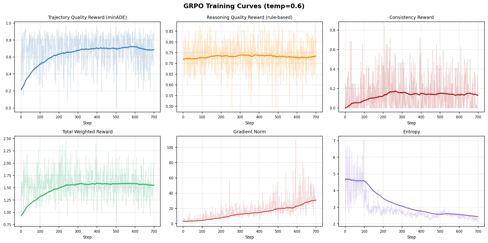

<div align="center">

# 🏔️ Alpamayo 1
### Bridging Reasoning and Action Prediction for Generalizable Autonomous Driving

[](https://huggingface.co/nvidia/Alpamayo-R1-10B)
[](https://arxiv.org/abs/2511.00088)
[](./LICENSE)

</div>

> **This is a fork** of [NVlabs/alpamayo](https://github.com/NVlabs/alpamayo) that adds **GRPO (Group Relative Policy Optimization) post-training pipeline** — the RL stage described in the [paper](https://arxiv.org/abs/2511.00088) but not included in the official release. See [GRPO Training](#grpo-post-training-unofficial) below for details and [Limitations](#limitations-vs-the-paper) for known differences from the paper.

Any PRs to fix bugs, improve training, reward implementation, etc are welcome!


## Requirements

| Requirement | Specification |
|-------------|---------------|
| **Python** | 3.12.x (see `pyproject.toml`) |
| **GPU** | NVIDIA GPU with ≥24 GB VRAM (e.g., RTX 3090, RTX 4090, A5000, H100) |
| **OS** | Linux (tested); other platforms unverified |

> ⚠️ **Note**: GPUs with less than 24 GB VRAM will likely encounter CUDA out-of-memory errors.

## Installation

### 1. Install uv (if not already installed)

```bash
curl -LsSf https://astral.sh/uv/install.sh | sh
export PATH="$HOME/.local/bin:$PATH"
```

### 2. Set up the environment

```bash
uv venv ar1_venv
source ar1_venv/bin/activate
uv sync --active
# For RL-post training, install the packages in `requirements.txt`.
uv pip install -r requirements.txt
```

### 3. Authenticate with HuggingFace

The model requires access to gated resources. Request access here:
- 🤗 [Physical AI AV Dataset](https://huggingface.co/datasets/nvidia/PhysicalAI-Autonomous-Vehicles)
- 🤗 [Alpamayo Model Weights](https://huggingface.co/nvidia/Alpamayo-R1-10B)

Then authenticate using the HuggingFace CLI:

```bash
# Install huggingface-cli if not already installed (included in transformers)
pip install huggingface_hub

# Login with your token
huggingface-cli login
```

Get your access token at: https://huggingface.co/settings/tokens

> 💡 **Tip**: For more details on HuggingFace authentication, see the [official documentation](https://huggingface.co/docs/huggingface_hub/guides/cli).

## Running Inference

### Test script

NOTE: This script will download both some example data (relatively small) and the model weights (22 GB).
The latter can be particularly slow depending on network bandwidth.
For reference, it takes around 2.5 minutes on a 100 MB/s wired connection.

```bash
python src/alpamayo_r1/test_inference.py
```

In case you would like to obtain more trajectories and reasoning traces, please feel free to change
the `num_traj_samples=1` argument to a higher number (Line 60).

### Interactive notebook

We provide a notebook with similar inference code at `notebook/inference.ipynb`.

## Relationship with the Paper

Alpamayo 1 implements the architecture described in our paper [*"Alpamayo-R1: Bridging Reasoning and Action Prediction for Generalizable Autonomous Driving in the Long Tail
"*](https://arxiv.org/abs/2511.00088), including:

| Feature | Paper Description | This Release (v1.0) |
|---------|-------------------|---------------------|
| **Chain-of-Causation (CoC) reasoning** | Hybrid auto-labeling with human in the loop for reasoning traces | ✅ Included |
| **Vision-Language-Action architecture** | Cosmos-Reason backbone + action expert | ✅ Included |
| **Trajectory prediction** | 6.4s horizon, 64 waypoints at 10 Hz | ✅ Included |
| **RL post-training** | Reinforcement learning for reasoning/action consistency | ✅ this fork |
| **Route/navigation conditioning** | Explicit navigation or route inputs | ❌ Not in this release |
| **Meta-actions/General VQA** | High-level behavior and visual question answering | ❌ Not in this release |

The official release focuses on the core supervised learning components. This fork adds the GRPO post-training pipeline (see below). Route conditioning and meta-actions remain unreleased.

## GRPO Post-Training (Unofficial)

This fork implements the GRPO reinforcement learning post-training stage described in Section 3.3 of the [Alpamayo-R1 paper](https://arxiv.org/abs/2511.00088). During GRPO, the VLM generates both Chain-of-Causation (CoC) reasoning text and discrete trajectory tokens via rollouts, then optimizes a composite reward signal using group-relative advantage estimation.

### Features

- **VLM-only rollouts** — the VLM autoregressively generates CoC text + 64 trajectory tokens; Expert and Diffusion modules are kept on CPU (not used during rollouts)
- **Heuristic reward functions** — trajectory quality (minADE-based), reasoning quality (rule-based), and reasoning-trajectory consistency
- **LoRA fine-tuning** — trains only VLM attention layers (q/k/v/o_proj) with LoRA (r=16, alpha=32) by default
- **Multi-GPU support** — DDP via Accelerate (FSDP is currently broken; see [Limitations](#limitations-vs-the-paper))

### Quick Start

```bash
# Smoke test (3 samples, 1 epoch)
./scripts/run_grpo.sh --smoke

# Full training run (DDP, auto-detected GPUs)
./scripts/run_grpo.sh --no-fsdp

# Single-GPU mode
./scripts/run_grpo.sh --no-fsdp --num-gpus 1

# Custom overrides
./scripts/run_grpo.sh --no-fsdp training.num_train_epochs=3 training.learning_rate=5e-6
```

See [`docs/grpo-training.md`](docs/grpo-training.md) for detailed documentation, configuration reference, and design decisions.

### Preliminary Results

Evaluated on 253 curated test clips (6.4s prediction horizon, 64 waypoints at 10 Hz, 5 trajectory samples per clip, averaged over 5 independent runs with different random seeds for token sampling). Results across all evaluated checkpoints:

| Model | minADE mean ± std | minFDE mean ± std |
|-------|-------------------|-------------------|
| Alpamayo-R1 base | 0.918 ± 0.030 | 2.446 ± 0.071 |
| + GRPO (temp=0.6, 300 steps) | 0.910 ± 0.040 | 2.431 ± 0.152 |
| **+ GRPO (temp=0.6, 400 steps)** | **0.898 ± 0.030** | **2.334 ± 0.099** |
| + GRPO (temp=0.6, 600 steps) | 0.918 ± 0.035 | 2.441 ± 0.088 |


The best checkpoint (temp=0.6, 400 steps) shows a trend toward lower minADE and minFDE compared to the base model. However, a paired statistical test (Wilcoxon signed-rank and paired t-test on per-clip scores) does not reach significance at the 0.05 level (minADE p≈0.53, minFDE p≈0.21).

#### Training Curves



### Limitations vs. the Paper

This is a community reimplementation based on the paper description. Several aspects differ from what is described in the paper or remain unknown:

| Aspect | Paper | This Implementation |
|--------|-------|---------------------|
| **CoC quality reward** | Uses a reasoning critic to score reasoning quality | Rule-based heuristic scoring causal connectors, driving vocabulary, length, and repetition. No LLM judge. |
| **Consistency reward** | Rule-based matching between CoC keywords and meta-actions | Keyword matching between CoC text and coarse trajectory behaviors (turning, braking, etc.). Currently disabled by default (weight=0.0). |
| **Reward weights** | Not disclosed | Trajectory 50%, reasoning 50%, consistency 0% (tuned empirically) |
| **Training data** | Internal dataset curation and filtering pipeline | Uses the public PhysicalAI-AV dataset with a single fixed timestamp per clip (t0=5.1s) |
| **FSDP** | Unknown | **Broken.** FSDP wrapping conflicts with LoRA + Qwen3-VL's tied embeddings, causing crashes during checkpoint saving. Use DDP (`--no-fsdp`) instead. |
| **vLLM rollouts** | Used in paper | Experimental support available when using this [PR](https://github.com/huggingface/trl/pull/5228) of TRL, but throughput is slower than native TRL Trainer |

The most significant gap is how the rewards are implemented.

## Frequently Asked Questions (FAQ)

<details>
<summary><strong>Does the 10B model accept navigation/route inputs?</strong></summary>

While we have experimented with route conditioning capabilities, the released model does **not** include this feature. The current release takes multi-camera video and egomotion history as inputs, without explicit navigation or route inputs (e.g., waypoints, turn-by-turn navigation instructions).

</details>

<details>
<summary><strong>Does the model produce meta-actions or support general VQA?</strong></summary>

While we have experimented with meta-action and general VQA capabilities, the released model does **not** include these features. Alpamayo 1 is designed specifically for trajectory prediction with Chain-of-Causation reasoning, producing trajectory + reasoning trace outputs.

</details>

<details>
<summary><strong>Was the 10B model post-trained with Reinforcement Learning (RL)?</strong></summary>

The official `nvidia/Alpamayo-R1-10B` weights have **not** undergone RL post-training. This fork provides a GRPO pipeline to perform that stage — see [GRPO Post-Training](#grpo-post-training-unofficial) above. Note that the resulting model will differ from what the paper describes due to the [limitations](#limitations-vs-the-paper) listed above.

</details>

<details>
<summary><strong>What are the minimum GPU requirements?</strong></summary>

You need an NVIDIA GPU with at least **24 GB VRAM** for inference. Tested configurations include RTX 3090, A100, and H100. Running on GPUs with less memory (e.g., 16 GB) will likely result in CUDA out-of-memory errors.

</details>

<details>
<summary><strong>Can I use this model in production / commercial applications?</strong></summary>

No. The model weights are released under a **non-commercial license**. This release is intended for research, experimentation, and evaluation purposes only. See the [License](#license) section and the [HuggingFace Model Card](https://huggingface.co/nvidia/Alpamayo-R1-10B) for details.

</details>

## Project Structure

```
alpamayo/
├── docs/
│   └── grpo-training.md                 # GRPO training documentation
├── notebooks/
│   └── inference.ipynb                  # Example notebook
├── scripts/
│   ├── run_grpo.sh                      # GRPO training launcher
│   └── evaluate_reward_signal.py        # Reward function evaluation
├── src/
│   └── alpamayo_r1/
│       ├── action_space/
│       │   └── ...                      # Action space definitions
│       ├── diffusion/
│       │   └── ...                      # Diffusion model components
│       ├── geometry/
│       │   └── ...                      # Geometry utilities and modules
│       ├── models/
│       │   └── ...                      # Model components and utils functions
│       ├── training/                    # GRPO post-training (this fork)
│       │   ├── configs/
│       │   │   └── grpo_default.yaml    # Hydra config for GRPO
│       │   ├── rollout.py               # AlpamayoGRPOTrainer (VLM-only rollouts)
│       │   ├── rewards.py               # Reward functions
│       │   ├── dataset.py               # Dataset builder
│       │   └── train_grpo.py            # Hydra entry point
│       ├── config.py                    # Model and experiment configuration
│       ├── helper.py                    # Utility functions
│       ├── load_physical_aiavdataset.py # Dataset loader
│       └── test_inference.py            # Inference test script
├── tests/
│   └── test_training.py                 # GRPO training tests
├── pyproject.toml                       # Project dependencies
└── uv.lock                              # Locked dependency versions
```

## Troubleshooting

### Flash Attention issues

The model uses Flash Attention 2 by default. If you encounter compatibility issues:

```python
# Use PyTorch's scaled dot-product attention instead
config.attn_implementation = "sdpa"
```

### CUDA out-of-memory errors

If you encounter OOM errors:
1. Ensure you have a GPU with at least 24 GB VRAM
2. Reduce `num_traj_samples` if generating multiple trajectories
3. Close other GPU-intensive applications

## License

- **Inference code**: Apache License 2.0 - see [LICENSE](./LICENSE) for details.
- **Model weights**: Non-commercial license - see [HuggingFace Model Card](https://huggingface.co/nvidia/Alpamayo-R1-10B) for details.

## Disclaimer

Alpamayo 1 is a pre-trained reasoning model designed to accelerate research and development in the autonomous vehicle (AV) domain. It is intended to serve as a foundation for a range of AV-related use cases-from instantiating an end-to-end backbone for autonomous driving to enabling reasoning-based auto-labeling tools. In short, it should be viewed as a building block for developing customized AV applications.

Important notes:

- Alpamayo 1 is provided solely for research, experimentation, and evaluation purposes.
- Alpamayo 1 is not a fully fledged driving stack. Among other limitations, it lacks access to critical real-world sensor inputs, does not incorporate required diverse and redundant safety mechanisms, and has not undergone automotive-grade validation for deployment.

By using this model, you acknowledge that it is a research tool intended to support scientific inquiry, benchmarking, and exploration—not a substitute for a certified AV stack. The developers and contributors disclaim any responsibility or liability for the use of the model or its outputs.

## Citation

If you use Alpamayo 1 in your research, please cite:

```bibtex
@article{nvidia2025alpamayo,
      title={{Alpamayo-R1}: Bridging Reasoning and Action Prediction for Generalizable Autonomous Driving in the Long Tail},
      author={NVIDIA and Yan Wang and Wenjie Luo and Junjie Bai and Yulong Cao and Tong Che and Ke Chen and Yuxiao Chen and Jenna Diamond and Yifan Ding and Wenhao Ding and Liang Feng and Greg Heinrich and Jack Huang and Peter Karkus and Boyi Li and Pinyi Li and Tsung-Yi Lin and Dongran Liu and Ming-Yu Liu and Langechuan Liu and Zhijian Liu and Jason Lu and Yunxiang Mao and Pavlo Molchanov and Lindsey Pavao and Zhenghao Peng and Mike Ranzinger and Ed Schmerling and Shida Shen and Yunfei Shi and Sarah Tariq and Ran Tian and Tilman Wekel and Xinshuo Weng and Tianjun Xiao and Eric Yang and Xiaodong Yang and Yurong You and Xiaohui Zeng and Wenyuan Zhang and Boris Ivanovic and Marco Pavone},
      year={2025},
      journal={arXiv preprint arXiv:2511.00088},
}
```
