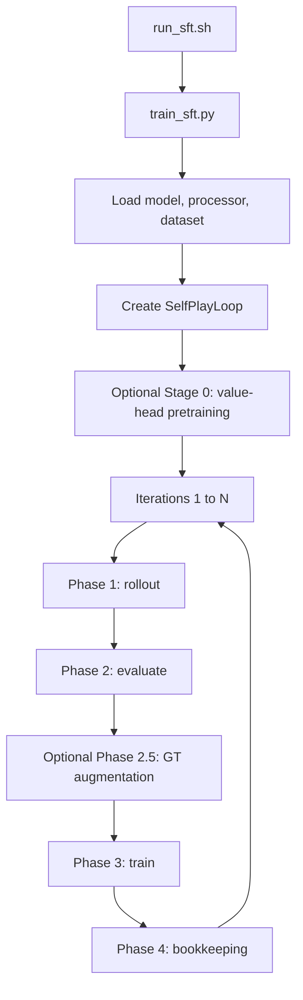
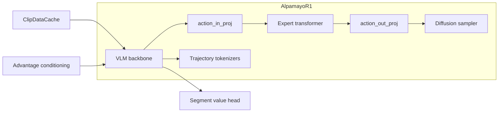
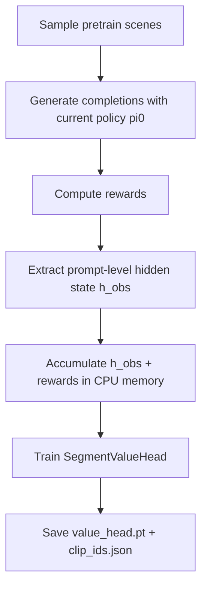
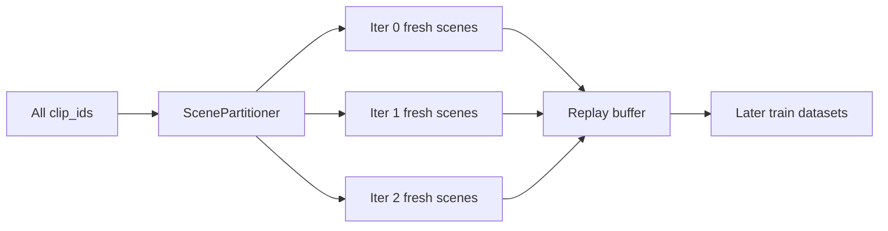
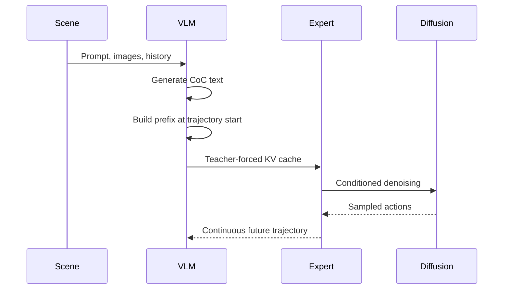
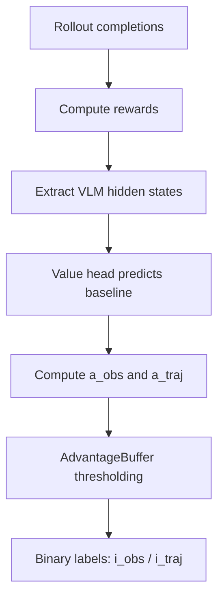
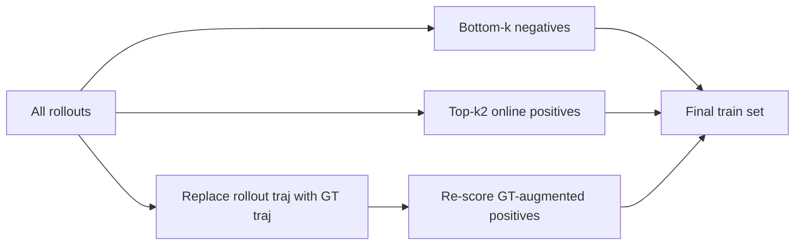
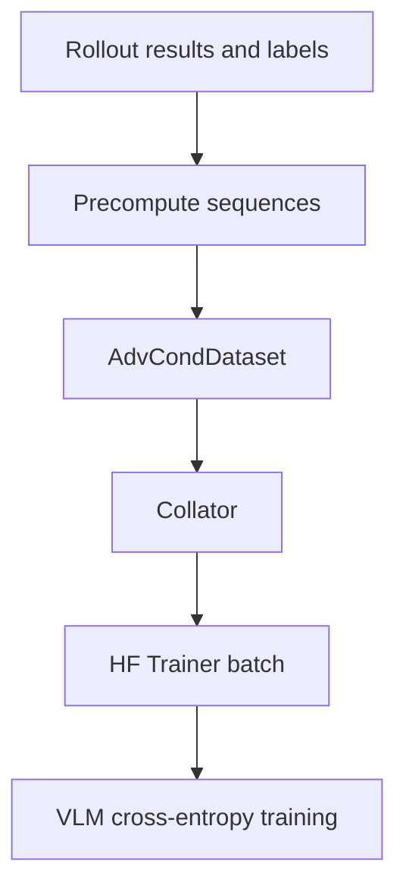
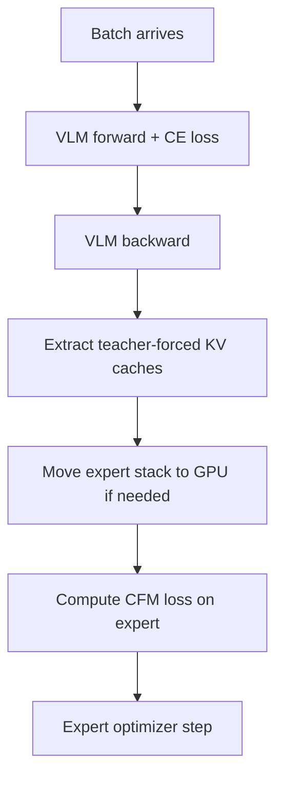
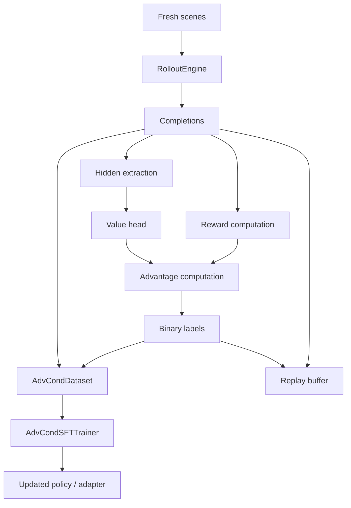

# SFT Pipeline Overview

This document summarizes how the **advantage-conditioned iterative SFT** pipeline works in Alpamayo-R1.

The implementation is centered around:

- `scripts/run_sft.sh`
- `src/alpamayo_r1/training/train_sft.py`
- `src/alpamayo_r1/training/selfplay_loop.py`
- `src/alpamayo_r1/training/sft_rollout.py`
- `src/alpamayo_r1/training/advantage_conditioning.py`
- `src/alpamayo_r1/training/sft_trainer.py`
- `src/alpamayo_r1/training/value_head.py`

---

## 1. What this pipeline is trying to do

The SFT pipeline does **not** train from fixed human-written demonstrations alone.
Instead, it runs an **iterative self-play loop**:

1. Start from the current driving policy.
2. Generate multiple candidate completions per scene.
3. Score those completions.
4. Convert scores into simple binary advantage labels.
5. Fine-tune the model to reproduce those completions **conditioned on their quality labels**.
6. Repeat for several iterations.

In practice, each completion contains:

- **CoC reasoning text**
- **future trajectory output**

Depending on rollout mode, the trajectory is produced either:

- directly by the **VLM** (`rollout.mode=vlm_only`), or
- by the **expert + diffusion stack** after the VLM generates the CoC prefix (`rollout.mode=expert`)

---

## 2. High-level pipeline



---

## 3. Main models used in the pipeline



### Roles of each component

- **VLM**
  - reads scene tokens, images, and trajectory history
  - generates CoC text
  - in `vlm_only` mode, also generates discrete future trajectory tokens
  - in training, it is the main module optimized with SFT

- **Segment value head**
  - predicts a scalar baseline from VLM hidden states
  - used during evaluation to compute advantages
  - updated every iteration

- **Action expert + diffusion**
  - used when `rollout.mode=expert`
  - takes VLM conditioning and samples continuous actions/trajectories
  - can also be fine-tuned during the SFT phase via deferred expert CFM training

- **Advantage tokens / embeddings**
  - encode whether a completion was good or bad at the observation and trajectory levels
  - inserted into the token sequence for conditional SFT

- **ClipDataCache**
  - caches processed scene data in CPU RAM
  - reused across rollout, evaluation, and training

---

## 4. Entry point and setup

The usual entry point is:

```bash
./scripts/run_sft.sh
```

That script:

- loads environment variables from `.env`
- selects accelerate config (`FSDP` or `DDP`)
- forwards CLI overrides into Hydra
- launches:

```bash
python -m alpamayo_r1.training.train_sft --config-name sft_default
```

The default config is:

- `src/alpamayo_r1/training/configs/sft_default.yaml`

### Important config groups

- `training`: inner-loop HF Trainer arguments
- `advantage_conditioning`: number of iterations, dropout, replay, labels
- `value_head`: value-head pretraining and per-iteration updates
- `expert_finetune`: optional expert CFM updates
- `rollout`: generation mode and sampling settings
- `data`: PhysicalAI-AV dataset selection

---

## 5. Stage 0: initialization in `train_sft.py`

`train_sft.py` does the top-level setup before the self-play loop starts.

### What it loads

1. **Distributed process group** if launched with Accelerate.
2. **Full AlpamayoR1 model**.
3. **Processor/tokenizer**.
4. **PhysicalAI-AV dataset interface**.
5. **Training-compatible VLM setup** via `prepare_vlm_for_training()`.
6. **Dataset of scenes** using `build_alpamayo_dataset()`.
7. **SelfPlayLoop** instance.

### Dataset shape

The dataset builder creates one row per scene with:

- `prompt`
- `clip_id`
- `t0_us`

The actual images, ego history, and future trajectory data are loaded lazily later using `clip_id` and `t0_us`.

---

## 6. Optional Stage 0: value-head pretraining

Before the iterative loop, the code can pretrain the value head if:

- `value_head.enabled=true`, and
- `value_head.pretrain_scenes > 0`

### Why this exists

The SFT loop needs a baseline value estimate to compute advantages. A randomly initialized value head would make those early advantages noisy.

### Pretraining flow



### What is learned

The value head learns to predict expected return from the observation-level hidden state.

Those pretrain scenes are then excluded from the later self-play scene partitioning.

---

## 7. Dataset partitioning across iterations

A key design choice is that **fresh rollouts are only generated once per scene**.

`ScenePartitioner`:

- shuffles all clip IDs
- splits them across `num_iterations`
- gives each iteration a fresh subset of scenes

This reduces overfitting to repeatedly sampled scenes.

There is also a **replay buffer** that stores previous rollout results and labels so earlier data can still be reused during training.



---

## 8. Per-iteration phases

Each self-play iteration has 4 main phases.

---

## 8.1 Phase 1: Rollout

Goal: generate `G` candidate completions for each fresh scene.

Implemented in:

- `SelfPlayLoop._rollout_phase()`
- `RolloutEngine.generate_completions()`

### Rollout inputs

For each scene:

- images
- ego history
- prompt text
- trajectory history placeholders/tokens

### Rollout outputs

Each completion becomes a record roughly like:

- `prompt_ids`
- `completion_ids`
- `pred_xyz`
- `gt_xyz`
- `coc_text`
- `clip_id`
- `t0_us`
- `completion_prefix`
- `hist_xyz`, `hist_rot`
- `expert_fut_xyz`, `expert_fut_rot`

### Two rollout modes

#### A. `vlm_only`

The VLM generates:

- CoC text
- `<|traj_future_start|>`
- discrete future trajectory tokens
- `<|traj_future_end|>`

#### B. `expert`

The VLM generates only the CoC prefix, then the expert stack generates the trajectory.



### Important rollout details

- scenes are sharded across distributed ranks
- scene data is prefetched via `ClipDataCache`
- in expert mode, batched teacher-forced VLM forward is used before diffusion
- there is also an `use_artificial_data` mode for sanity checks

---

## 8.2 Phase 2: Evaluate

Goal: score the generated completions and convert scores into simple labels.

Implemented in:

- `SelfPlayLoop._evaluate_phase()`
- reward computation inside `RolloutEngine`
- advantage logic in `advantage_conditioning.py`

### Step 1: compute rewards

Each completion is scored by reward components such as:

- `r_traj`
- `r_reason`
- `r_consist`

The weighted combination is controlled by:

- `rewards.trajectory_weight`
- `rewards.reasoning_weight`
- `rewards.consistency_weight`

### Step 2: extract hidden states

If value-head mode is enabled, the pipeline extracts VLM hidden states for value estimation.

Two supported extraction modes:

- `prompt`: use prompt-level hidden state only (`h_obs`)
- `segment`: use more detailed segment hidden extraction

### Step 3: compute advantages

The value head predicts a baseline. Advantages are then computed from:

- actual reward-derived return
- minus predicted value baseline

The code ultimately produces per-completion values like:

- `a_obs`
- `a_traj`

### Step 4: update value head

After using the current value head to score the rollouts, the pipeline trains the value head on the newly collected rollout data so the next iteration has a better baseline.

### Step 5: binarize

Advantages are turned into binary labels using thresholds tracked in `AdvantageBuffer`:

- `i_obs ∈ {pos, neg}`
- `i_traj ∈ {pos, neg}`

So each completion becomes something like:

- `(obs+, traj+)`
- `(obs+, traj-)`
- `(obs-, traj+)`
- `(obs-, traj-)`



---

## 8.3 Phase 2.5: GT augmentation

If `advantage_conditioning.augment_with_gt=true`, the pipeline builds an improved training set by mixing:

- **bottom-k** low-advantage rollout negatives
- **GT-augmented positives** where the trajectory portion is replaced by the dataset GT trajectory
- **top-k2** strong online positives

This is implemented in:

- `SelfPlayLoop._augment_negative_traj_with_gt()`

### Intuition

This phase keeps hard negative examples from policy rollouts while adding stronger positive examples anchored to the real dataset trajectory.



---

## 8.4 Phase 3: Train

Goal: fine-tune the VLM with advantage-conditioned SFT, and optionally fine-tune the expert.

Implemented in:

- `SelfPlayLoop._train_phase()`
- `precompute_conditioned_sequences()`
- `AdvCondDataset`
- `AdvCondSFTTrainer`

### Step 1: prepare the model for this iteration

The loop either:

- **resets to the base model** each iteration (`reset_to_base=true`), or
- **continues from previous iteration weights** by merging earlier LoRA adapters

Then it:

- freezes non-VLM parameters
- applies fresh LoRA to the VLM if enabled
- attaches the advantage embedding if using embedding-mode conditioning

### Step 2: build the training dataset

The train dataset is built from:

- current iteration rollouts
- sampled historical replay data

Then the code precomputes token sequences for both:

- **conditional** version
- **unconditional** version

### How advantage-conditioned sequences are formed

For a completion with labels `(i_obs, i_traj)`:

```text
Conditional:
[prompt] + [adv_obs token] + [CoC part] + [adv_traj token] + [trajectory part]

Unconditional:
[prompt] + [full completion]
```

The labels mask out prompt and inserted conditioning-token positions with `IGNORE_INDEX`, so the loss is only applied to the actual generated completion tokens.

### Conditioning dropout

At dataset read time, if a sample is all-positive and dropout fires (`p_drop`), the trainer uses the **unconditional** sequence instead of the conditional one.

This creates a classifier-free-guidance-style pair of behaviors:

- conditional path
- unconditional path

### Training data path



### Loss

`AdvCondSFTTrainer.compute_loss()` uses normal language-model cross-entropy from the VLM output.

If `alpha != 1.0`, conditional examples are reweighted relative to unconditional ones.

---

## 8.5 Optional expert finetuning inside the train step

The train step can also fine-tune the action expert with a deferred schedule.

Implemented in:

- `AdvCondSFTTrainer.training_step()`
- `AdvCondSFTTrainer._expert_cfm_step()`

### Why deferred scheduling is used

The VLM is large, and the expert stack also consumes GPU memory. Running both heavy steps at once would be expensive.

So each training step is split logically into:

1. **VLM SFT forward/backward**
2. **Expert CFM step after activations are freed**



### What the expert step uses

It consumes metadata carried by `AdvCondDataset`, including:

- `clip_id`
- `t0_us`
- `completion_prefix`
- `hist_xyz`, `hist_rot`
- expert future trajectory target

The expert target is usually the rolled-out trajectory, though GT-augmented samples can substitute the GT future.

---

## 8.6 Phase 4: Bookkeeping and checkpointing

At the end of each iteration, the loop:

1. adds rollout data and labels to the replay buffer
2. saves the current iteration checkpoint unless disabled

Saved artifacts can include:

- VLM LoRA adapter
- merged full AlpamayoR1 checkpoint
- `expert_checkpoint.pt`
- `value_head.pt`
- `adv_embedding.pt`
- resolved config and logs

---

## 9. Model/data flow in one iteration



---

## 10. What is actually optimized

### Always optimized during SFT phase

- **VLM parameters** through LoRA adapters, unless `--no-lora` / `lora.enabled=false`

### Sometimes optimized

- **advantage embedding module** if using embedding-mode conditioning
- **value head** during pretraining and evaluation updates
- **expert + action projection layers** if `expert_finetune.enabled=true`

### Usually frozen during VLM SFT

- non-VLM base model modules, unless in the dedicated expert step

---

## 11. Why this is called “advantage-conditioned iterative SFT”

It is:

- **iterative** because the policy is updated over multiple self-play rounds
- **SFT** because the main policy update is teacher-forced cross-entropy, not policy gradient
- **advantage-conditioned** because generated completions are relabeled with quality indicators and replayed as conditional supervised examples

This lets the system turn RL-style quality signals into a more stable supervised training problem.

---

## 12. Practical summary

If you want to mentally model the pipeline, the shortest summary is:

1. Generate several candidate driving behaviors per scene.
2. Score them with rewards and a value baseline.
3. Convert those scores into simple positive/negative labels.
4. Re-train the model to imitate those behaviors while telling it which ones were good or bad.
5. Repeat until the policy improves.

---

## 13. Related files

- `scripts/run_sft.sh`
- `src/alpamayo_r1/training/train_sft.py`
- `src/alpamayo_r1/training/selfplay_loop.py`
- `src/alpamayo_r1/training/sft_rollout.py`
- `src/alpamayo_r1/training/sft_trainer.py`
- `src/alpamayo_r1/training/advantage_conditioning.py`
- `src/alpamayo_r1/training/value_head.py`
- `src/alpamayo_r1/training/configs/sft_default.yaml`
- `docs/advantage-conditioning.md`
- `docs/value-head.md`
